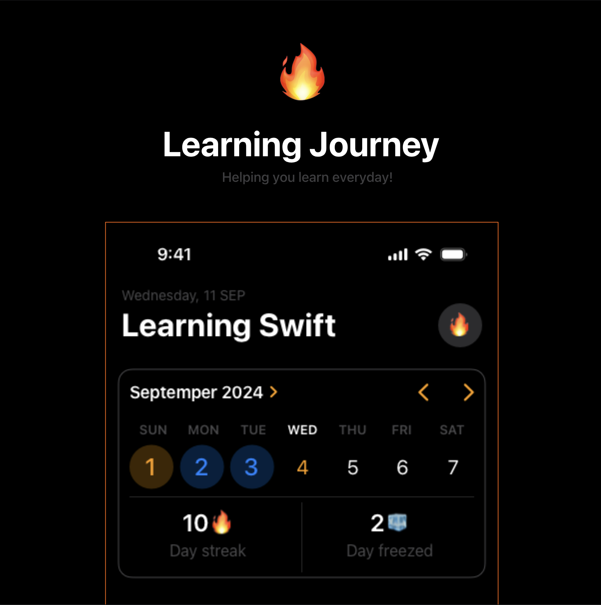
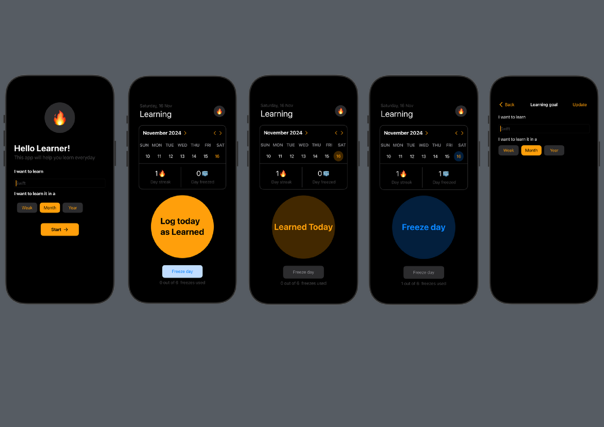

# Learning Journey 🔥


# Learning Journey App 📚🔥

A minimalistic and intuitive app that helps users track their learning journey with daily and weekly goals, freeze days, and streak tracking. Whether you're learning a new skill, language, or technology, this app is designed to motivate and keep you on track every step of the way!

## Features ✨

- **Onboarding Screen**: Welcomes the user and helps them set their learning goals, including selecting the duration (Week, Month, Year).
- **Calendar Overview**: Provides a monthly view to track progress day by day.
- **Streak and Freeze Days**: Allows users to log a learning day to maintain their streak, with a feature to "freeze" days to maintain the streak during off-days.
- **Goal Update**: Option to update learning goals at any time.
- **Simple and Clear UI**: A user-friendly, dark-themed interface designed for seamless tracking and engagement.

## Screenshots 📱



## Getting Started 🚀

Follow these steps to set up the project on your local machine.

### Prerequisites

- **iOS 14.0+**
- **Xcode 12+**
- **Swift 5**

### Installation

1. **Clone the Repository**
   ```bash
   git clone https://github.com/yourusername/LearningJourneyApp.git
   ```

2. **Navigate to the Project Directory**
   ```bash
   cd LearningJourneyApp
   ```

3. **Open the Project in Xcode**
   ```bash
   open LearningJourneyApp.xcodeproj
   ```

4. **Build and Run the App** on a Simulator or connected iOS device.

## Usage 💡

1. **Set Your Goal**: On the onboarding screen, enter the skill or topic you wish to learn and set a goal duration.
2. **Log Daily Progress**: Each day, log your progress to continue your streak.
3. **Use Freeze Days**: Select "Freeze day" if you can't log progress on a particular day. Each user is allowed a limited number of freeze days per week.
4. **Track Your Streak and Freeze Days**: The app calculates and displays both your learning streak and freeze days used for easy reference.

## Code Structure 🛠️

- **Main Views**: Contains the primary screens like the onboarding, daily log, and settings.
- **Models**: Defines data models for tracking days, goals, and streaks.
- **Controllers**: Handles the logic for streak calculations, goal updates, and freeze day limits.
- **Utilities**: Helper functions and extensions for managing dates, UI elements, and user interactions.

## Contributing 🤝

Feel free to contribute to this project. Here’s how:

1. Fork the repository.
2. Create a new branch for your feature or bug fix.
3. Make your changes.
4. Open a pull request with a clear description of your work.

